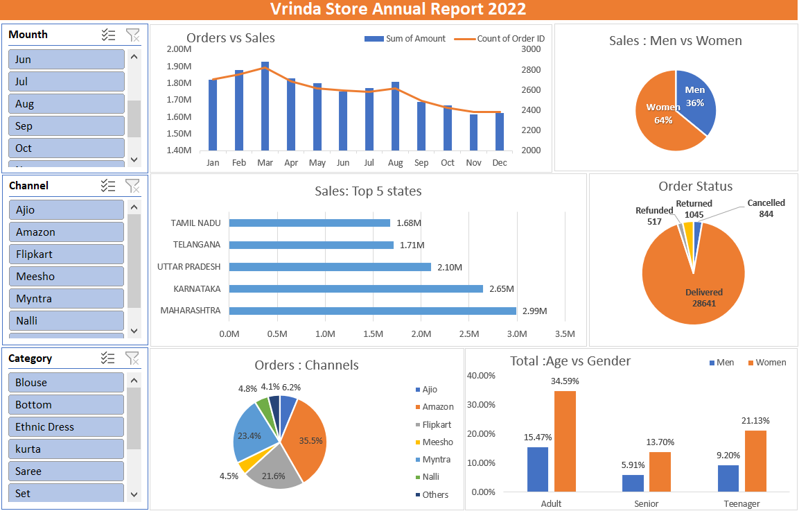
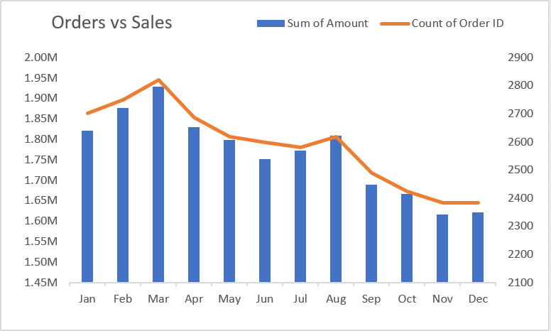
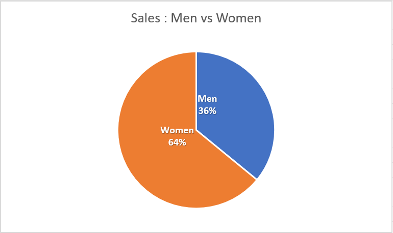
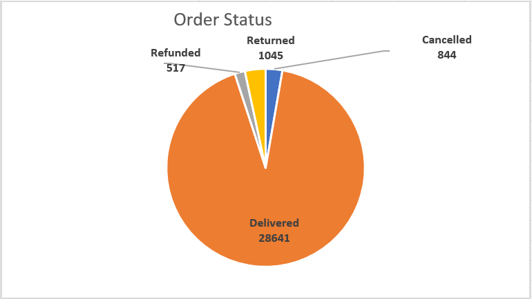
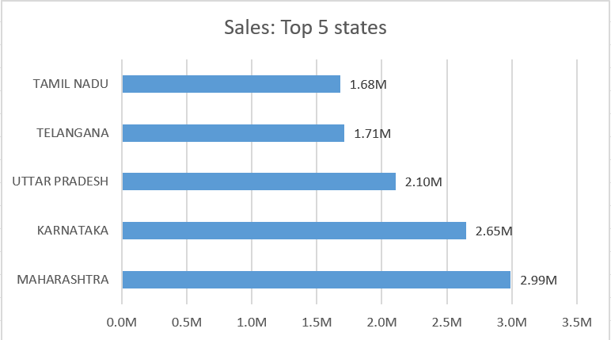
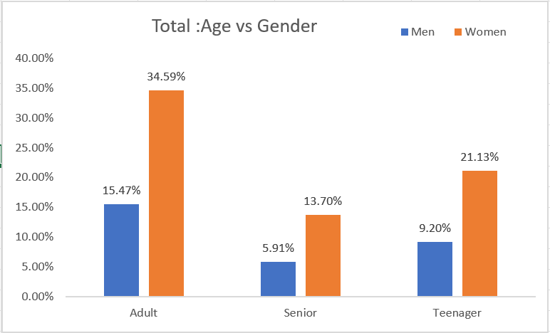
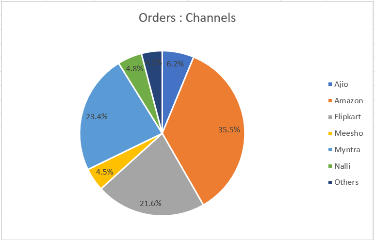

# Clothing-Store-Data-Analysis-Report-by-Excel


---
## Introduction

This is a Vrinda Clothing dashboard who sales Manager can understand their customers and grow more sales in 2023 ,by Order ID, Customers ID etc...
The data is from an Excel document, which provides a foundation in analyzing data using this powerful tool. The data contains detailed information on Order ID,Customer ID,CustomerS Name,Status of sales,Channel of sales,ship-state etc...

## Dashboard File

My final [dashboard](https://github.com/Othmane-data/Clothing-Store-Data-Analysis-Report-by-Excel/blob/main/Clothing-Store%20Data%20Analysis.xlsx)

## Problem statement

1. Compare the sales and orders using single chart.
2. which month got the highest sales and orders?
3. Who purchased more, men or women in 2022?
4. What are different order status in 2022?
5. List top 5 States contributing to the sales.
6. Relation between age and gender based on number of orders .
7. Which channel is contributing to maximum sales?

## Skills/ concepts demonstrated

- 🧮 Data Cleaning and Data Processing
- 📉 Charts and Visualization
- ❎ Conclusion and Recommendations

### 🧮 Data Cleaning and Data Processing :

- Age group,Mounth;
```
- Age group=IF(E2>=50,"Senior",
        IF(E2>=30,"Adult","Teenager"))
  
- Mounth=TEXT(G2,"mmm")
```

### 📉 Charts and Visualization :

The report comprises 6 charts:

___1. Orders vs Sales;___

___2. Sales : Men vs Women;___

___3. Orders Status;___

___4. Sales : Top 5 States;___

___5. Relation between age and gender;___

___6. Orders : Channels.___

we're use the pivot table for every shart

__- Features:__
- Order Date by Mounth Timeline;
- Channel Slicer;
- Category Slicer.

 the all dashboard 

___1. Orders vs Sales;___



_March, January and February are the months which marked the top sales with ___1.92 M,1.88 M and 1.82 M___ sum of amount and ___2819,2750 and 2720___ orders. 🤓_

___2. Sales : Men vs Women;___



_Women are more likely to buy compared to men with 65% . 🤓_

___3. Orders Status;___



_this store deliver in 2022 more than ___28641___ orders . 🤓_

___4. Sales : Top 5 States;___



_MAHARASHTRA,KARNATAKA and UTTAR PRADESH are the top 3 states with 69,54 % . 🤓_

___5. Relation between age and gender;___



_Adult age group (30-49 yrs) is max contributing 50 %  . 🤓_

___6. Orders : Channels.___



_Amazon,Flipkart and Myntra channels are max contributing 80 % . 🤓_

### ❎ Conclusion and Recommendations:

Target __Women__ customers of age group __30-49__ yrs living in ___MAHARASHTRA,KARNATAKA and UTTAR PRADESH___ by showing ads/offers/coupons available on ___Amazon,Flipkart and Myntra___. 😄

